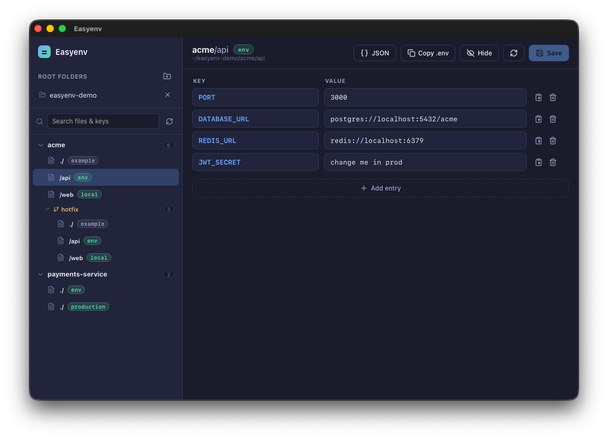

# Easyenv

A local-first desktop GUI to browse and edit the `.env` files scattered across **all** your projects — grouped by project, with git worktree awareness, key search, and format-preserving saves.

> Editing `.env` files in `vi` gets old fast. Easyenv lists every `.env` on your machine by project and lets you edit keys and values in a clean table.

<!-- Add a screenshot at docs/screenshot.png and it will show up here -->
<!--  -->

## Why

Most projects have one or more `.env` / `.env.local` files, and they're tedious to open and edit one by one in a terminal editor. Existing tools either manage **system** environment variables (not project files), live inside an editor extension, or are cloud secret managers. Easyenv fills the gap: a small native app that finds your project `.env` files and edits them as key/value pairs.

## Features

- **Scan registered roots** — point it at your work folders (e.g. `~/projects`) and it recursively finds every `.env*` file. `node_modules`, `.git`, `target`, `dist`, etc. are skipped automatically.
- **Project grouping** — files are grouped under their **git repository** (not just the leaf folder). Monorepo role folders like `backend` / `web` / `api` fold under the parent project.
- **Git worktree aware** — `.env` files inside linked worktrees fold under their main repo and show a `⑂ branch` badge.
- **Key search** — search by file, project, path, **or key name**; matching keys are highlighted as chips.
- **Format-preserving saves** — comments, blank lines, `export` prefixes, and quote styles are kept exactly. Writes are atomic (temp file + rename).
- **Copy helpers** — copy a single key, a value, one `KEY=value` pair, the **whole file as `.env` text** (pastes straight into Vercel and similar dashboards), or as **JSON**.
- **JSON view** — see the whole file as a `{ }` object.
- **Value masking** — toggle to hide/show values.
- **100% local** — no network, no telemetry, no account. Your secrets never leave your machine.

## Privacy

Easyenv has **zero network access**. It only reads and writes files under the folders you register, plus a small `settings.json` (your registered roots) in the app's config directory. There is no analytics, no sync, no cloud.

## Install

> Currently built for **Apple Silicon (arm64)**. For Intel, build a universal binary from source (see below).

### Homebrew (cask)

```sh
brew install --cask kei155/easyenv/easyenv
```

(The cask lives in a `homebrew-easyenv` tap under your account. See [Releases](https://github.com/kei155/easyenv/releases) for direct `.dmg` downloads.)

### Direct download

Grab the `.dmg` from the [Releases page](https://github.com/kei155/easyenv/releases), open it, and drag **Easyenv** to Applications.

> The app is not notarized by Apple. macOS may block it on first launch ("damaged / unidentified developer"). To allow it:
> ```sh
> xattr -dr com.apple.quarantine /Applications/Easyenv.app
> ```

## Usage

1. Click **+** next to **Root folders** and pick a folder to scan (e.g. `~/projects`).
2. Easyenv lists every `.env*` under it, grouped by project. Click one to open it.
3. Edit keys/values in the table. **⌘S** (or the Save button) writes back.
4. Use **Copy .env** / **JSON** in the header to copy the whole file, or the per-row copy buttons for a single key, value, or pair.

## Build from source

Requires [Node.js](https://nodejs.org) and the [Rust toolchain](https://rustup.rs).

```sh
git clone https://github.com/kei155/easyenv.git
cd easyenv
npm install

# run in dev
npm run tauri dev

# build a release .app + .dmg (arm64)
npm run tauri build

# build a universal binary (Intel + Apple Silicon)
rustup target add x86_64-apple-darwin aarch64-apple-darwin
npm run tauri build -- --target universal-apple-darwin
```

Artifacts land in `src-tauri/target/release/bundle/` (or `.../universal-apple-darwin/release/bundle/`).

## Tech

[Tauri 2](https://tauri.app) · React + TypeScript + Vite · Rust backend (`walkdir` for scanning, a small hand-rolled `.env` parser for format preservation).

## License

[MIT](LICENSE)
